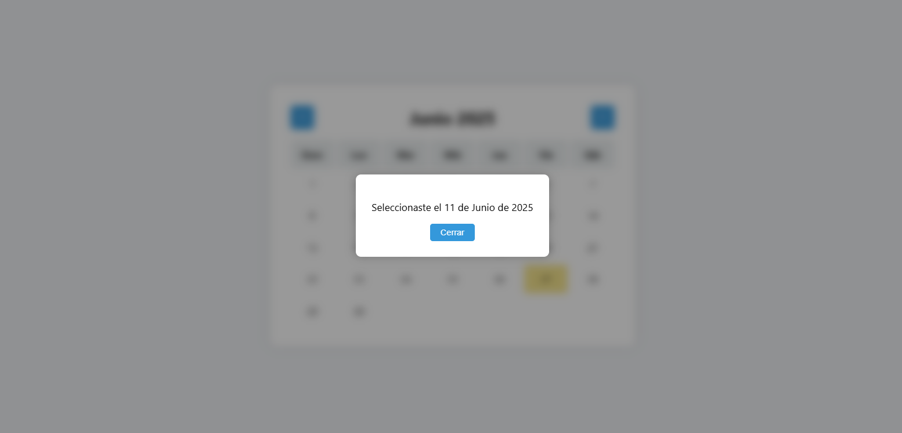

# DESCRIPCION

Este es el punto 2 del ejercicio del calendario. Esta vez teniendo la interfaz correctamente generada vamos a aplicar un poco de lo aprendido en los anteriores ejercicios.

### Situacion de ROL
Terminaste correctamente la tarea anterior, el jefe te felicita y automáticamente te encarga que la continúes vos.
Lo que quiere ahora es que cuando hagas click en uno de los dias salga un modal como este  y que se pueda cerrar desde el botón.
Te dió muy pocas indicaciones pero dice que revisará el codigo una vez termines y no antes. 

Trabajar sin mucha información no es lo mejor del mundo pero en el mundo laboral actual es lo más común, hacer preguntas suele ser una gran alternativa
pero parece ser que en este caso de tu jefe no obtendras respuestas, hay que valerse por uno mismo

# TEST TEORIA

1. ¿Se puede añadir un evento a otro evento?
2. ¿Cuál es la sintaxis de la creación de un evento?
3. ¿Aparte del 'click' qué otros disparadores existentes consideras utiles para el futuro recordar?
4. ¿Una página puede ser 100% dinámica?
5. Explica las modificaciones que hiciste con tus palabras linea por linea

1.

2.

3.

4.

5.

